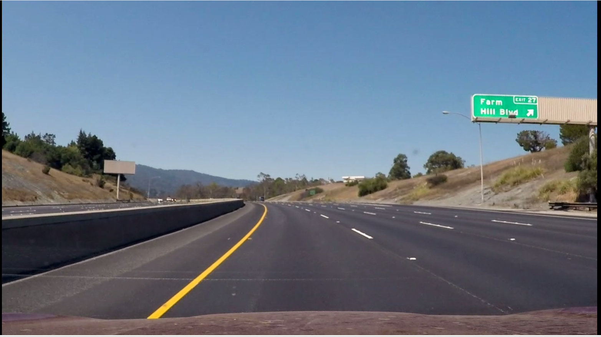
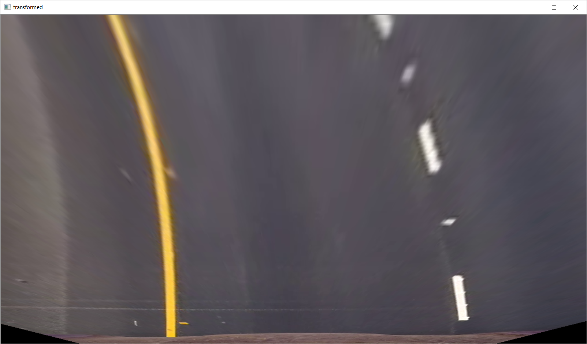
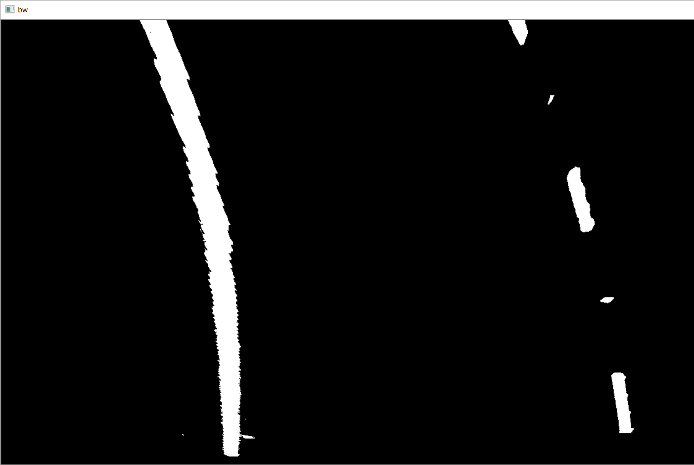
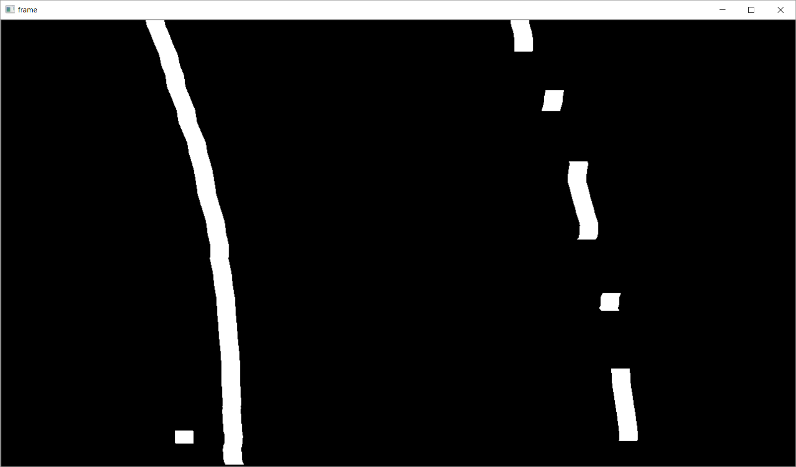
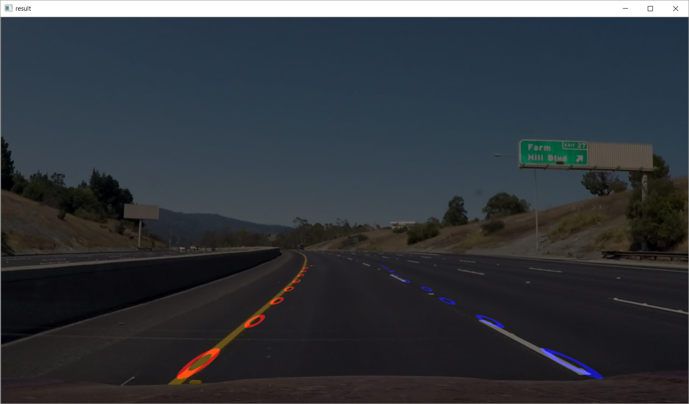

# ADAS

To practice and  simulate ADAS problems. #python

## Video output
https://www.youtube.com/watch?v=PPw3vZqzIu4&t=25s
[Video output youtube](https://www.youtube.com/watch?v=PPw3vZqzIu4&t=25s "Video Link")

LANE Detection Approach:

Process Flow  ‘
1. Perspective transform
2. White/Yellow extraction in HSV color space.
3. Extract with custom filter
4. Find Left and Right Lane path
5. Merge with original Image

Input Image: 
 

1.Perspective Transform. 
To transform view to top/bird view
  
  

2. White/Yellow extraction in HSV color space.
Extracted white and yellow color with hsv color space. 
Created a mask with combination of white and yellow area.
 
 

3.Extract Lane with custom filter 
Used a custom filter which can retrieve only lane like object.  The filter is having 2 weights as combination of (negative positive negative) with the size of 20x90.
Kernel = [-1[20x30] 1[20x30] -1[20x30]
With this kernel the lane is more likely to be visible. 

4.  Find Left and Right Lane path
a)	From column mean two peak points are identified as left and right lane.
b)	With left and right peak values sliding window (bottom of peak to top) approach is followed to find the lane paths
c)	For every sliding window the center of pixel distribution is considered as path for the specific window. 

a.	Custom filter([1,0,-1]) is applied to get narrow line of broad line.
b.	Average of x is calculated as distribution and y as middle of the window.
	                  
		
		
    
5. Merge with original Image
	The left and right lane paths are identified with the previous steps. Those paths are reverse transformed to merge with original image as follows.

 

Future Approach: 
a.	Location of the vehicle will be identified (i.e whether it is moving outside the lane)
b.	Curve of the lanes will be calculated (i.e turing left/right)
c.	Clear path will be calculated with Polynomial Fit with separate left and right path values.
